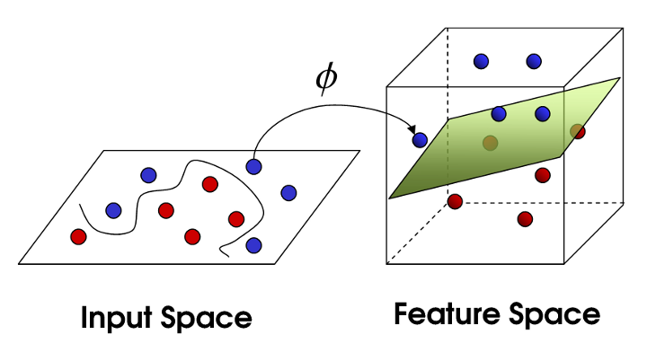

```{r setup, include = FALSE}
knitr::opts_chunk$set(
  echo = FALSE, fig.height = 3.2, fig.width = 6, cache = TRUE,
  cache.path = "_cache/", fig.path = "figure/", warning = FALSE, message = FALSE,
  fig.align = "center"
)
options(width = 55)  # if 4:3 set to 55, otherwise 70
library(tidyverse)
library(iprior)
library(directlabels)
theme_set(
  theme_classic() +
      theme(
        # axis.title.x = element_text(hjust = 1),
        # axis.title.y = element_text(angle = 0),
        axis.ticks = element_blank(),
        axis.text = element_blank()
      )
)

navyblue <- "#002f5c"
solidpink <- "#8E3B46"
```

# Introduction
<!-- ### Abstract -->

<!-- Regression analysis is undoubtedly an important tool to understand the relationship between one or more explanatory and independent variables of interest.  -->
<!-- The problem of estimating a generic regression function in a model with normal errors is considered. -->
<!-- For this purpose, a novel objective prior for the regression function is proposed, defined as the distribution maximizing entropy (subject to a suitable constraint) based on the Fisher information on the regression function. -->
<!-- This prior is called the I-prior. -->
<!-- The regression function is then estimated by its posterior mean under the I-prior, and accompanying hyperparameters are estimated via maximum marginal likelihood.  -->
<!-- Estimation of I-prior models is simple and inference straightforward, while predictive performances are comparative, and often better, to similar leading state-of-the-art models--as will be illustrated by several data examples. -->
<!-- Further plans for research in this area are also presented, including variable selection for interaction effects and extending the I-prior methodology to non-Gaussian errors. -->
<!-- Please visit the project website for further details: https://phd.haziqj.ml/ -->

<!-- \vspace{1em} -->
<!-- Keywords: Bayes, Fisher information, RKHS, Gaussian process, EM algorithm -->

<!-- ### Plan -->

<!-- - Introduction -->
<!-- - Some basic functional analysis (?) -->
<!-- - The I-prior  -->
<!-- - Estimation -->
<!-- - Inference -->
<!-- - Examples -->
<!-- - Further work (variable selection, interaction effects, non-gaussian errors) -->


For $i=1,\dots,n$, consider the regression model

\begin{equation}\label{mod1}
\begin{gathered}
y_i = f(x_i) + \epsilon_i \\
(\epsilon_1,\dots,\epsilon_n)^\top \sim \N_n(0, \Psi^{-1})
\end{gathered}
\end{equation}

where each $y_i\in\bbR$, $x_i\in \cX$ (some set of covariates), and $f$ is a regression function.
This forms the basis for a multitude of statistical models:

1. Ordinary linear regression when $f$ is parameterised linearly.
<!-- $f(x_i) = x_i^\top\beta$, with $\cX,\beta\in\bbR^p$. -->

2. Varying intercepts/slopes model when $\cX$ is grouped.
<!-- $f(x_{ij},j) = f_1(x_i) + f_2(j) + f_{12}(x_{ij},j)$. -->

3. Smoothing models when $f$ is a smooth function.

4. Functional regression when $\cX$ is functional.


::: {.block}
#### Goal
To estimate the regression function $f$ given the observations $\{(y_i,x_i)\}_{i=1}^n$.
:::

### Ordinary linear regression

Suppose $f(x_i) = x_i^\top \beta$ for $i=1,\dots,n$, where $x_i,\beta \in \bbR^p$.

\vspace{1em}

```{r linear-reg}
set.seed(211022)
m <- 8
n <- 15
dat <- tibble(
  grp = 1:m,
  beta0 = rnorm(m, mean = seq(1, 15, length = m), sd = 0.1),
  beta1 = rnorm(m, mean = -1, sd = 0.01)
) %>%
  expand_grid(x = 1:n) %>%
  mutate(
    x = seq(0, 10, length = n()) + runif(n(), -1, 1),
    y = rnorm(n(), mean = beta0 + beta1 * x, sd = 1.5),
    grp = factor(grp)#, levels = sample(8, 8))
  )

ggplot(dat, aes(x, y)) +
  geom_point() +
  geom_smooth(method = "lm", se = FALSE, col = "navyblue")
```

### Varying intercepts/slopes model

Suppose each unit $i=1,\dots,n$ relates to the $k$th observation in group $j\in\{1,\dots,m\}$.
Model the function $f$ additively:
\only<1>{
$$
f(x_{kj}, j) = f_1(x_{kj}) + f_2(j) + f_{12}(x_{kj},j).
\phantom{\myunderbrace{x_{kj}^\top\beta_1}{f_1}}
$$
}
\only<2>{
$$
f(x_{kj}, j) =
\myunderbrace{x_{kj}^\top\beta_1}{f_1} +
\myunderbrace{\beta_{0j}}{f_2} +
\myunderbrace{x_{kj}^\top\beta_{1j}}{f_{12}}
\phantom{f_1(x_{kj})}
$$
}
\vspace{-2em}

::: {.onlyenv latex=<1>}

```{r var-int-slope1, fig.height = 2.8}
ggplot(dat, aes(x, y, col = grp)) +
  geom_point() +
  # geom_smooth(method = "lm", se = FALSE) +
  guides(col = "none") +
  scale_color_viridis_d()
```

:::

::: {.onlyenv latex=<2>}

```{r var-int-slope2, fig.height = 2.8}
ggplot(dat, aes(x, y, col = grp)) +
  geom_point() +
  geom_smooth(method = "lm", se = FALSE) +
  guides(col = "none") +
  scale_color_viridis_d()
```

:::

### Smoothing models

Suppose $f\in\cF$ where $\cF$ is a space of "smoothing functions" (models like LOESS, kernel regression, smoothing splines, etc.).

```{r smooth1, fig.height = 2.8}
dat <- iprior::gen_smooth() %>% rename(x = X)
ggplot(dat, aes(x, y)) +
  geom_point() +
  geom_smooth(se = FALSE, col = "navyblue")
```

### Functional regression

Suppose the input set $\cX$ is functional.
The (linear) regression aims to estimate a coefficient function $\beta:\cT\to\bbR$
$$
y_i = \myunderbrace{\int_\cT x_i(t)\beta(t) \dint t}{f(x_i)} + \epsilon_i
$$

```{r functionalx, fig.height = 2.2 * 1.2, fig.width = 6 * 1.2}
# Load data set
data(tecator, package = "caret")
endpoints <- as_tibble(endpoints)
colnames(endpoints) <- c("water", "fat", "protein")
absorp <- as_tibble(absorp)
colnames(absorp) <- 1:100

dat <-
  bind_cols(id = seq_len(nrow(endpoints)), endpoints, absorp) %>%
  slice_sample(n = 100)

p1 <- ggplot(dat, aes(x = 1, y = fat)) +
  geom_boxplot() +
  geom_jitter(width = 0.2, aes(col = fat)) +
  scale_color_viridis_c() +
  guides(col = "none") +
  theme_void()

p2 <- dat %>%
  pivot_longer(cols = `1`:`100`, names_to = "x") %>%
  ggplot(aes(as.numeric(x), value, col = fat, group = id)) +
  geom_line() +
  scale_color_viridis_c() +
  guides(col = "none") +
  theme_void()

cowplot::plot_grid(p1, p2, rel_widths = c(1, 3), labels = c("y", "x"))
```

### The I-prior

For the regression model stated in \eqref{mod1}, we assume that $f$ lies in some RKHS of functions $\cF$, with reproducing kernel $h$ over $\cX$.

::: {.definition name="I-prior"}
\label{def:iprior}
The entropy maximising prior distribution for $f$, subject to constraints, is \vspace{-0.7em}
\begin{equation}
\begin{gathered}\label{iprior}
f(x) = \sum_{i=1}^n h(x,x_i)w_i \\
(w_1,\dots,w_n)^\top \sim \N_n(0, \Psi) \vspace{-0.7em}
\end{gathered}
\end{equation}
:::

Therefore, the covariance kernel of $f(x)$ is determined by the function \vspace{-0.4em}
$$
k(x,x') = \sum_{i=1}^n\sum_{j=1}^n \Psi_{ij} h(x,x_i )h(x',x_j),
$$
which happens to be **Fisher information** between two linear forms of $f$.

### The I-prior (cont.)

Interpretation:

<!-- > The more information about $f$, the larger its prior variance, and hence the smaller the influence of the prior mean (and vice versa). -->

\vspace{-1em}

\begin{empheq}[box=\tcbhighmath]{align*}
\begin{split}
&\color{navyblue}\text{The more information about } f, \text{ the larger its prior variance,} \\[-0.2em]
&\color{navyblue}\text{and hence the smaller the influence of the prior mean (and} \\[-0.2em]
&\color{navyblue}\text{vice versa).}
\end{split}
\end{empheq}

\pause

\vspace{0.2em}

Of interest then are

1. Posterior distribution for the regression function,
$$
p\big(f \,|\, y\big) =
\frac{p(y \,|\, f)p(f)}
{\int p( y \,|\, f)p( f) \dint  f}.
$$


2. Posterior predictive distribution (given a new data point $x_{new}$)
$$
p(y_{new} \,|\, \mathbf y) = \int p( y_{new} \,|\, f_{new}) p( f_{new} \,|\, \mathbf y) \dint f_{new},
$$
where $f_{new} = f(x_{new})$.

### Introduction (cont.)

Observations $\{(y_i,x_i) \mid y_i,x_i\in\bbR \ \forall i=1,\dots,n\}$.

\vspace{1em }

```{r datapoints, cache = TRUE}
set.seed(197)
dat <- gen_smooth() %>% rename(x = X)
ggplot(dat, aes(x, y)) +
  geom_point() +
  theme_classic() +
  coord_cartesian(ylim = c(min(dat$y), max(dat$y)))
```

### Introduction (cont.)

Choose $h(x,x') = e^{-\frac{\lVert x - x' \rVert^2}{2s^2}}$ (Gaussian kernel).
Sample paths from I-prior:

\vspace{0.5em}

```{r priorsamp, cache = TRUE}
mod <- iprior(y ~ x, dat, kernel = "se", control = list(silent = TRUE))
n <- nrow(dat)
prior.samp <- dat[, -1, drop = FALSE]
H <- kern_se(dat$x)
psi <- get_psi(mod)
lambda <- get_lambda(mod)
for (i in 1:100) {
  w <- rnorm(n, mean = 0, sd = sqrt(psi))
  prior.samp <- cbind(prior.samp, mean(dat$y) +
                        as.numeric(lambda * H %*% w / 2))
}
colnames(prior.samp) <- c("x", paste0("y", 1:100))
prior.samp <- reshape2::melt(prior.samp, id = "x")
ggplot(dat, aes(x, y)) +
  geom_point() +
  geom_line(data = prior.samp, aes(x, value, group = variable),
            size = 0.2, alpha = 0.4, col = "gray50") +
  theme_classic() +
  coord_cartesian(ylim = c(min(dat$y), max(dat$y)))
```

### Introduction (cont.)

Sample paths from the posterior of $f$:

\vspace{1em}

```{r postsamp, cache = TRUE}
post.samp <- dat[, -1, drop = FALSE]
Vy <- (H * lambda) %*% (H * lambda) + diag(1/psi, n)
w <- mvtnorm::rmvnorm(100, mean = mod$w, sigma = solve(Vy))
for (i in 1:100) {
  post.samp <- cbind(post.samp, mean(dat$y) + as.numeric(lambda * H %*% w[i, ]))
}
colnames(post.samp) <- c("x", paste0("y", 1:100))
post.samp <- reshape2::melt(post.samp, id = "x")
ggplot(dat, aes(x, y)) +
  geom_point() +
  geom_line(data = post.samp, aes(x, value, group = variable),
            size = 0.2, alpha = 0.4, col = "gray50") +
  theme_classic() +
  coord_cartesian(ylim = c(min(dat$y), max(dat$y)))
```

### Introduction (cont.)

Posterior mean estimate for $y=f(x)$ and its 95% credibility interval.

\vspace{1em}

```{r ipriorplot, cache = TRUE}
plot_fitted_navyblue <- function (x, X.var = 1, cred.bands = TRUE, size = 1,
                                  linetype = "solid")
{
    fit <- fitted(x, intervals = cred.bands)
    y.hat <- fit$y
    X <- x$ipriorKernel$Xl[[X.var]]
    if (!is.null(dim(X))) {
        if (ncol(X) > 1)
            X <- X[, X.var]
    }
    plot.df <- data.frame(y.hat = y.hat, x = X, y = get_y(x))
    x.lab <- x$ipriorKernel$xname[X.var]
    y.lab <- x$ipriorKernel$yname
    nys.check <- iprior:::is.ipriorKernel_nys(x$ipriorKernel)
    p <- ggplot(plot.df)
    if (isTRUE(cred.bands)) {
        p <- p + geom_ribbon(aes(x = X, ymin = fit$lower, ymax = fit$upper),
            fill = "grey", alpha = 0.5)
    }
    if (isTRUE(nys.check)) {
        p <- p + geom_point(aes(x, y), alpha = 0.15) + geom_point(data = plot.df[seq_len(x$ipriorKernel$nystroml$nys.size),
            ], aes(x, y), size = 2, shape = 1, stroke = 1)
    }
    else {
        p <- p + geom_point(aes(x, y))
    }
    p + geom_line(aes(x, y.hat), col = navyblue, size = size, linetype = linetype) +
        labs(x = x.lab, y = y.lab) + theme_bw()
}

plot_fitted_navyblue(mod) +
  theme_classic() +
  coord_cartesian(ylim = c(min(dat$y), max(dat$y)))
```

### Why I-priors?


::: {.columns}

::: {.column width=48%}


Advantages

- Provides a unifying methodology for regression.

- Simple and parsimonious model specification and estimation.

- Often yield comparable (or better) predictions than competing ML algorithms.

:::

::: {.column width=48%}
\vspace{-1.5em}
```{r, out.width = "90%"}
knitr::include_graphics("figure/wordcloud.pdf")
```
:::

:::

\vspace{0.5em}

Competitors:

- Tikhonov regulariser (e.g. cubic spline smoother)
$$
\hat f = \argmin_f \sum_{i=1}^n (y_i - f(x_i))^2 + \lambda \int f''(x)^2 \dint x
$$

- Gaussian process regression

### State of the art

::: {.columns}

::: {.column width="48%"}
\vspace{-1.8em}
```{r wicher, out.width = "30%", fig.align = "right"}
knitr::include_graphics("figure/wicher.jpg")
```

:::

::: {.column width="48%"}
\small
Professor Wicher Bergsma

*London School of Economics and Political Science*
:::

:::

\vspace{0.5em}

\scriptsize

1. \fullcite{jamil2018phdthesis}

2. \fullcite{bergsma2019}

3. \fullcite{jamil_iprior_2019}

4. \fullcite{bergsma_regression_2020}

5. \fullcite{jamil_bayesian_2021}

6. \fullcite{jamil_bergsma_2022}

# Regression using I-priors

## Reproducing kernel Hilbert spaces

> Assumption: Let $f \in \cF$ be an RKHS with kernel $h$ over a set $\cX$.

::: {.definition name="Hilbert spaces"}
A *Hilbert space* $\cF$ is a vector space equipped with a positive semidefinite inner product $\langle\cdot,\cdot\rangle_\cF : \cF \times \cF \to \bbR$.
:::

<!-- ::: {.definition name="Kernels"} -->
<!-- A function $h:\cX \times \cX \to \bbR$ is called a *kernel* if $\exists \cF$ and  $\phi:\cX\to\cF$ such that $\forall x,x' \in \cX$, -->
<!-- $h(x,x') = \langle \phi(x), \phi(x') \rangle$. -->
<!-- ::: -->

::: {.definition name="Reproducing kernels"}
A symmetric, bivariate function $h:\cX \times \cX \to \bbR$ is called a *kernel*, and it is a *reproducing kernel* of $\cF$ if $h$ satisfies $\forall x \in \cX$,

i. $h(\cdot,x) \in \cF$; and
ii. $\langle f, h(\cdot, x) \rangle_\cF = f(x)$, $\forall f \in \cF$.

In particular, $\forall x,x'\in\cF$,
$h(x,x') = \langle h(\cdot, x), h(\cdot, x') \rangle_\cF$.
:::

<!-- ### Reproducing kernel Hilbert spaces (cont.) -->

<!-- - In ML literature, Mercer's Theorem states -->
<!-- $$ -->
<!-- h(x,x') = \langle \phi(x), \phi(x') \rangle_\cV \hspace{1em}\Leftrightarrow\hspace{1em} h \text{ is semi p.d.} -->
<!-- $$ -->
<!-- where $\phi: \cX \to \cV$ is a mapping from $\cX$ to the *feature space* $\cV$. -->

<!-- - In many ML models, need not specify $\phi$ explicitly; computation is made simpler by the use of kernels. -->

<!-- ```{r featuremap, out.width = "60%"} -->
<!--  -->
<!-- ``` -->


### Reproducing kernel Hilbert spaces (cont.)

::: {.theorem}
There is a bijection between

i. the set of positive semidefinite functions; and
ii. the set of RKHSs.
:::

```{r rkhss, fig.height = 3, fig.width = 7}
psi <- 1
lambda <-  1
N <- 100
B <- 5

my_y <- function(k = "linear", seed = 31122) {
  set.seed(seed)
  res <- tibble(x = seq(0, 2 * pi, length = N), kernel = k)

  if (k == "linear") H <- kern_linear(res$x)
  if (k == "fbm") H <- kern_fbm(res$x)
  if (k == "se") H <- kern_se(res$x)
  if (k == "constant") H <- matrix(1, nrow = N, ncol = N)
  #kern_poly(res$x, d = 3, c = 2, lam.poly = 0.4)

  for (i in 1:B) {
    w <- rnorm(N, mean = 0, sd = sqrt(psi))
    res <- bind_cols(res, as.numeric(lambda * H %*% w))
  }
  colnames(res) <- c("x", "kernel", paste0("y", 1:B))
  return(res)
}

prior.samp <- bind_rows(
  my_y("linear"),
  my_y("fbm"),
  my_y("se"),
  my_y("constant")
) %>% suppressMessages()

prior.samp <- reshape2::melt(prior.samp, id = c("x", "kernel"))
prior.samp$kernel <- factor(prior.samp$kernel,
                            levels = c("constant", "linear", "fbm", "se"))
levels(prior.samp$kernel) <- c("Constant", "Linear",
                               "Fractional Brownian motion",
                               "Gaussian")

ggplot(prior.samp, aes(x, value, group = variable, col = variable)) +
  geom_line() +
  facet_wrap(. ~ kernel, ncol = 2, scales = "free") +
  scale_colour_viridis_d() +
  theme_classic() +
  theme(axis.ticks = element_blank(), axis.text = element_blank()) +
  guides(col = "none") +
  labs(y = "y")
```

<!-- ::: {.corollary} -->
<!-- Any $f\in\cF$ can be approximated arbitrarily well by functions of the form -->
<!-- $$ -->
<!-- \tilde f(x) = \sum_{i=1}^n h(x,x_i) w_i -->
<!-- $$ -->
<!-- for some constants $w_1,\dots,w_n \in \bbR$, because $\cF$ is the completion of the vector space $\tilde \cF = \operatorname{span}\{ h(\cdot,x) \mid x \in \cX \}$ equipped with the squared norm $\lVert \tilde f \rVert^2 = \sum_{i,j=1}^n w_iw_jh(x_i,x_j)$. -->
<!-- ::: -->

### Building more complex RKHSs

We can build complex RKHSs by adding and multiplying kernels:

- $\cF = \cF_1 \oplus \cF_2$ is an RKHS defined by $h= h_1 + h_2$.

- $\cF = \cF_1 \otimes \cF_2$ is an RKHS defined by $h = h_1h_2$.

::: {.example name="ANOVA RKHS"}
Consider RKHSs $\cF_k$ with kernel $h_k$, $k=1,\dots,p$.
The ANOVA kernel over the set $\cX = \cX_1 \times \cdots \times \cX_p$ defining the ANOVA RKHS $\cF$ is
$$
h(x,x') = \prod_{k=1}^p \big(1 + h_k(x,x')\big).
$$
For $p=2$ let $\cF_k$ be linear RKHS of functions over $\bbR$.
Then $f \in \cF$ where $\cF=\cF_\emptyset \oplus \cF_1 \oplus \cF_2 \oplus \cF_1\otimes\cF_2$ are of the form
$$
f(x_1,x_2) = \beta_0 + \beta_1x_1 + \beta_2x_2 + \beta_3 x_1x_2. \vspace{-0.5em}
$$

:::

## The Fisher information

For the regression model \eqref{mod1},
the log-likelihood of $f$ is given by
$$
\ell(f|y) = \text{const.} - \frac{1}{2} \sum_{i=1}^n\sum_{j=1}^n \psi_{ij}
\big(y_i - \langle f, h(\cdot,x_i) \rangle_\cF \big)
\big(y_j - \langle f, h(\cdot,x_j) \rangle_\cF \big)
$$


::: {.lemma name="Fisher information for regression function"}
The Fisher information for $f$ is
$$
\cI_f = -\E\nabla^2 \ell(f|y) = \sum_{i=1}^n\sum_{j=1}^n \psi_{ij}h(\cdot,x_i) \otimes h(\cdot,x_j)
$$
where '$\otimes$' is the tensor product of two vectors in $\cF$.
:::

### The Fisher information (cont.)

It's helpful to think of $\cI_f$ as a bilinear form $\cI_f:\cF \times \cF \to \bbR$, making it possible to compute the Fisher information on linear functionals $f_g = \langle f, g \rangle_\cF$, $\forall g\in\cF$ as $\cI_{f_g} = \langle \cI_f, g\otimes g\rangle_{\cF \otimes \cF}$.

\vspace{1em}


In particular, between two points $f_x:=f(x)$ and $f_{x'}:=f(x')$
\textcolor{gray}{[since $f_x = \langle f,h(\cdot,x)\rangle_\cF$]}
we have:
\begin{align}
\cI_f(x,x')
&= \left\langle \cI_f, h(\cdot,x) \otimes h(\cdot,x') \right\rangle_{\cF  \otimes \cF} \nonumber \\
&=   \left\langle \sum_{i=1}^n\sum_{j=1}^n \psi_{ij} h(\cdot,x_i) \otimes h(\cdot,_j)
\ , \ h(\cdot,x) \otimes h(\cdot,x') \right\rangle_{\cF  \otimes \cF} \nonumber \\
&= \sum_{i=1}^n\sum_{j=1}^n \psi_{ij}
\left\langle h(\cdot,x) , h(\cdot,x_i) \right\rangle_{\cF}
\left\langle h(\cdot,x') , h(\cdot,x_j) \right\rangle_{\cF} \nonumber \\
&= \sum_{i=1}^n\sum_{j=1}^n \psi_{ij}  h(x,x_i)h(x',x_j) =: k(x,x') \label{eq:fikern}
\end{align}


## The I-prior

::: {.lemma}
The kernel \eqref{eq:fikern} induces a finite-dimensional RKHS $\cF_n < \cF$, consisting of functions of the form $\tilde f(x) = \sum_{i=1}^n h(x,x_i)w_i$ (for some real-valued $w_i$s) equipped with the squared norm
$$
\lVert \tilde f \rVert^2_{\cF_n} = \sum_{i,j=1}^n \psi^-_{ij}w_iw_j,
$$
where $\psi^{-}_{ij}$ is the $(i,j)$th entry of $\Psi^{-1}$.
:::

- Let $\cR$ be the orthogonal complement of $\cF_n$ in $\cF$. Then $\cF = \cF_n \oplus \cR$, and any $f\in\cF$ can be uniquely decomposed as $f=\tilde f + r$, with $\tilde f \in \cF_n$ and $r \in \cR$.

- The Fisher information for $g$ is zero iff $g \in \cR$. The data only allows us to estimate $f\in\cF$ by considering functions in $\tilde f \in \cF_n$.


### The I-prior (cont.)

::: {.theorem name="I-prior"}
Let $\nu$ be a volume measure induced by the norm above.
The solution to
$$
\argmax_p \left\{ -\int_{\cF_n } p(f) \log p(f) \, \nu(\dint f) \right\}
$$
subject to the constraint
$$
\E_{f \sim p} \lVert f \rVert^2_{\cF_n} = \text{constant}
$$
is the Gaussian distribution whose covariance function is $k(x,x')$.
:::

Equivalently, under the I-prior, $f$ can be written in the form
$$
f(x) = \sum_{i=1}^n h(x,x_i)w_i, \hspace{2em} (w_1,\dots,w_n)^\top \sim \N(0,\Psi)
$$


# Estimation

## Posterior regression function

::: {.lemma}
Under the normal model \eqref{mod1} subject to the I-prior, the posterior distribution of $f(x)$ is given by

:::

## Parameters of the model

\vspace{-1.5em}

\begin{equation}\label{mod2}
\begin{gathered}
y_i = f_0(x_i) + \lambda\sum_{j=1}^n h(x_i,x_j)w_j + \epsilon_i \\
(\epsilon_1,\dots,\epsilon_n)^\top \sim \N_n(0, \bPsi^{-1}) \\
(w_1,\dots,w_n)^\top \sim \N_n(0, \bPsi)
\end{gathered}
\end{equation}

Further assumptions

<!-- - Modelling using I-prior entails choosing appropriate kernels for the problem at hand. -->

1. The error variance $\Psi$ is known up to a low-dimensional parameter, e.g. $\bPsi = \psi \mathbf I_n$, $\psi >0$.

2. Each RKHS $\cF$ of function is defined by the kernel $h_\lambda = \tilde h$, where $\lambda \in \bbR$ is a scale^[This necessitates the use of reproducing kernel Krein spaces.] parameter.

3. Certain kernels also require parameters themselves, e.g. the Hurst coefficient of the fBm or the lengthscale of the Gaussian kernel.

4. A prior mean function $f_0(x)$ may be set by the user.

### Marginal likelihood

::: {.columns}

::: {.column width=48%}
Denote by

- $\mathbf y = (y_1,\dots,y_n)^\top$
- $\mathbf f = \big(f(x_1),\dots,f(x_n)\big)^\top$
- $\mathbf f_0 = \big(f_0(x_1),\dots,f_0(x_n)\big)^\top$
- $\mathbf w = (w_1,\dots,w_n)^\top$
- $\mathbf H_\lambda = \big(h_\lambda(x_i,x_j)\big)_{i,j=1}^n \in \bbR^{n\times n}$

:::

::: {.column width=48%}
\eqref{mod1} + an I-prior on $f$ implies
\begin{align*}
\mathbf y\mid\mathbf f &\sim \N_n(\mathbf f,  \boldsymbol\Psi^{-1}) \\
\mathbf f &\sim \N_n(\mathbf f_0, \mathbf H_\lambda \bPsi \mathbf H_\lambda)
\end{align*}

Thus, $\mathbf y \sim \N_n(\mathbf f_0, \myunderbrace{\mathbf H_\lambda \bPsi \mathbf H_\lambda + \bPsi^{-1}}{\mathbf V_y})$.
:::

:::

\vspace{0.5em}

The marginal log-likelihood of $(\lambda, \bPsi)$ is
$$
L(\lambda, \bPsi \mid \mathbf y)  = \text{const.} - \frac{1}{2}\log|\mathbf V_y| - \frac{1}{2}(\mathbf y - \mathbf f_0)^\top \mathbf V_y (\mathbf y - \mathbf f_0),
$$

- Direct optimisation using e.g. conjugate gradients or Newton methods. 

- Numerical stability issues (workaround: Cholesky or eigen decomp.).

- Prone to local optima.

### EM algorithm

An alternative view of the model:
\begin{align*}
\mathbf y\mid\mathbf w &\sim \N_n(\mathbf f_0 + \mathbf H_\lambda w,  \boldsymbol\Psi^{-1}) \\
\mathbf w &\sim \N_n(\mathbf 0, \bPsi )
\end{align*}
in which the $\mathbf w$ are "missing". 
The full data log-likelihood is
\begin{align*}
L(\lambda, \bPsi \mid \mathbf y, \mathbf w)
&= \log p(\mathbf y\mid\mathbf w,\lambda,\bPsi) + \log p(\mathbf w | \bPsi) \\
&= \text{const.} 
- \frac{1}{2}(\mathbf y - \mathbf f_0)^\top \bPsi (\mathbf y - \mathbf f_0) 
- \frac{1}{2}\operatorname{tr}\left(\mathbf V_y \mathbf w \mathbf w^\top \right) \\
&\hspace{2em}+ (\mathbf y - \mathbf f_0)^\top \bPsi \mathbf H_\lambda \mathbf w
\end{align*}

Choose starting values $\lambda^{(0)}$ and $\bPsi^{(0)}$.
The E-step entails computing 
$$
Q(\lambda,\bPsi) = \E \left\{ L(\lambda, \bPsi \mid \mathbf y, \mathbf w) \ \Big| \ \mathbf y, \lambda^{(t)},\bPsi^{(t)} \right\}
$$

### EM algorithm (cont.)

The following quantities are needed and are easily obtained:
$$
\tilde{\mathbf w} := \E(\mathbf w \mid \mathbf y, \lambda,\bPsi ) \hspace{2em}\text{and}\hspace{2em} \tilde{\mathbf W} := \E(\mathbf w\mathbf w^\top  \mid \mathbf y, \lambda,\bPsi ) = \tilde{\mathbf V_w} + \tilde{\mathbf w}\tilde{\mathbf w}^\top
$$

Supposing $\bPsi$ but not $\mathbf H_\lambda$ depends on $\psi$; and $\mathbf H_\lambda$ depends on $\lambda$ but not $\psi$, the M-step entails solving the following equations set to zero:
\begin{align*}
\frac{\partial Q}{\partial \lambda} 
&= -\frac{1}{2}\operatorname{tr}\left( \frac{\partial \mathbf V_y}{\partial \lambda}  \tilde{\mathbf W}^{(t)} \right) 
+ (\mathbf y - \mathbf f_0)^\top \bPsi \frac{\partial \mathbf H_\lambda}{\partial \lambda} \tilde{\mathbf w}^{(t)} \\
\frac{\partial Q}{\partial \psi} 
&=
-\frac{1}{2} \operatorname{tr}\left( \frac{\partial \mathbf V_y}{\partial \psi} \tilde{\mathbf W}^{(t)} \right)
-\frac{1}{2}(\mathbf y - \mathbf f_0)^\top \left( \mathbf y - \mathbf f_0 -2 \mathbf H_\lambda \tilde{\mathbf w}^{(t)} \right)
\end{align*}

- This scheme admits a closed-form solution for $\psi$ and (sometimes) for $\lambda$ too (e.g. linear addition of kernels $h_\lambda=\lambda_1 h_1 + \cdots + \lambda_p h_p$)

- Sequential updating $\lambda^{(t)} \rightarrow \bPsi^{(t+1)}\rightarrow\lambda^{(t+1)} \rightarrow \cdots$ (expectation conditional maximisation, \cite{meng1993maximum}).

# Examples

# Further research

Hello


